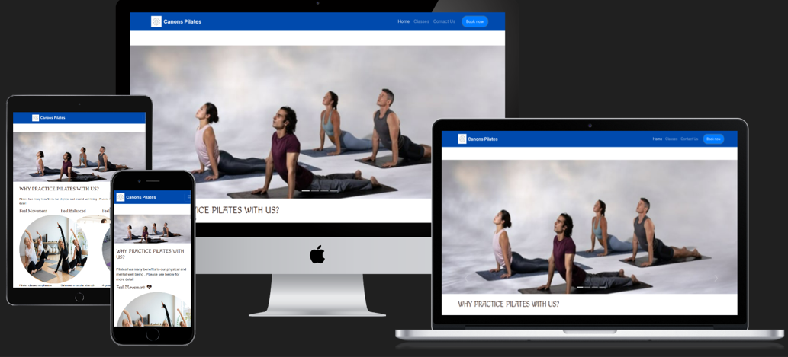
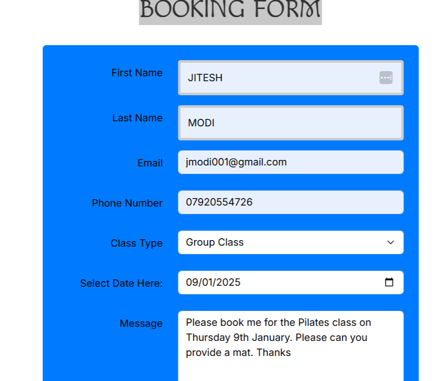

- - -

# Canons Pilates

Canons Pilates is a fictional Pilates Centre located in Edgware, North West London, UK. The current process in the way they are looking to place bookings for classes needs to be completely changed and adjusted with the use of a functional and user-friendly website.

The website created for them is a four-page website enabling students and potential students with the passsinate interest of taking up Pilates. Benefits Pilates will bring to their physical and mental health, well being and day to lives. Easily navigate to the type of classes available, when the classes are available and the cost of each class. The site provides its main objective with the ability to book a class online and receive a confirmation message.

[View the live project here.](https://jmodi16.github.io/Pilates/)

## Contents

* [Languages Used](#languages-used)
* [User Experience](#user-stories)
* [Design](#design)
  * [Typography](#typography)
  * [Wireframes](#wireframes)
* [Structure](#design)
  * [Features](#features)
  * [Features For The Future](#features-for-the-future)
* [Technologies Used](#technologies-used)
  * [ Frameworks, Libraries & Programs Used](#frameworks-libraries--programs-used)
* [Testing](#testing)
  * [User Experience](#user-experience-ux)
  * [Accessibility](#accessibility)
  * [Deployment](#deployment)
  * [Run locally](#run-locally)
* [Credits](#credits)
* [Acknowledgements](#acknowledgements)

- - - 
#### **Languages Used**

*[HTML] (https://getbootstrap.com/docs/5.3/getting-started/introduction/) and (https://www.w3schools.com/bootstrap/bootstrap_get_started.asp)
*[CSS3] and (https://getbootstrap.com/docs/3.4/css/) and (https://www.w3schools.com/css/default.asp)

### **User Stories**

#### **First Time Visitor Goals**  
 1.As a first-time visitor, I would understand what Pilates is about  
2.As a first-time visitor, I need to know the the postures involved in Pilates  
3\. As a first-time visitor, I need to see images of the postures and asanas which take place in different classes. The site needs to be visually appealing with catchy images.  
4\. As a first time visitor I need to easily view information on type of classes, days, times, location and prices.  
5\. As a first time visitor I need to be able to book a class.  
6\. As a first time visitor, I need to check social-media links, so I can join and keep up to date with events, offers and classes available.  
#### **Regular Pilates students**
 1\. As a regular visitor, I want to find information on different types of classes offered  
2\. As a regular visitor, I need to find information on different type of classes which maybe on offer to suit my personal requirements.  
3\. As a regular visitor, I need to find information on existing classes which may be additional offered during the week.  
4\. As a regular visitor, I need to check social-media links, so I can join and keep up to date with events, offers and classes available.

#### **Design, Layout & Structure**  
 I chose to have a bright, clean, bold design mainly using blue for my Navigation bar and Footer and Form. I used(#004aad) which is bootstrap primary blue color with lots of visual content such as large eye-catching images.

#### **Wireframes** 

INFORMATION TO FOLLOW  

#### **Structure** 
 
The structure of the site is informed by the scope, user and business goals as well as the principles of IXD (interaction design) to make sure I was conforming to user’s expectations and making everything as intuitive as I could. 
 
The site has a simple structure made up of 4 page links from the Navigation bar: 
* Homepage – A  Carousel with four images of pilates classes 
* Classes - more detailed information about the type of classes for students. 
* Book Us - information about booking the band and a booking enquiry form. 
* There is also 1 additional sub page; 
    * A thank you confirmation page for when a user has submitted the form to book a class. 
    The site has a navbar which remains fixed to the top of the page on desktop, tablet and mobile i this allows a user to access any page they need at any time and would be suitable for a returning visitor who knows exactly where they want to go. There is also a footer on every page with quick links to all pages,  the company pilates social media sites used and a booking button 
 
There is also another method of navigation, a preferred pathway through the site via ‘Quick Links’ located at the footer of all pages, enabling a first time user through the content. This is designed primarily for students who want to book a class their preferred running class.  

#### **Colour** 
 

To Follow ! 
 

### **Fonts** 

I imported [Google Fonts]  with the google fonts imported link on each page ('https://fonts.googleapis.com/css2?family=Inter:wght@100..900&family=Macondo&display=swap') 

I used the Inter Sans-Serif as the primary font and Mocando Cursive as the Secondary font as a backup in case the primary font failed. I found the Inter Sans-Serif font is a user-friendly, outstanding and clean typeface that contributes the design. I love the way letters A, M and W stand out in each heading. I was inspired by using the Inter Sans-Serif font when I completed the BoardWalk Games site using on the Code Institute learning management system module. https://jmodi16.github.io/boardwalk-games/ 

 

## **Features**

  
## **Home Page** 
 
### **Navigation Bar**

* The site has a navbar which remains fixed to the top of the page on desktop, tablet and mobile i this allows a user to access any page they need at any time and would be suitable for a returning visitor who knows exactly where they want to go. There is also a footer on every page with quick links to all pages,  the company pilates social media sites used and a booking button
* The responsive navigation bar has been applied to all three pages so that the pages are uniform, which is more visually appealing and improves user experience. It is also 'sticky' so that it is visible at all times no matter where the user is on the webpage. The navigation bar includes clear links to the Home, Classes, Contact Us and Book Now pages. 
*The navigation section promotes ease of use for the user, allowing the user to move easily between sections and pages. There is a striking image on the homepage to attract the attention of the user. Athlete image, which is compact displays a typical althlete performing a superb pilates asana.It is in a circular format, with Pilates labelled twice around the image. 
 
 
	

*The Carousel is found at the top of the home page, below the navigation bar.It is autoplaying and also gives the user the option to navigate back and forth with clear indicators on the left and right of the carousel section. Carousel consists of four large images underneath the Navigation bar . Please see first image below. The remaining images you can see from the site when you navigate across and allow the carousel to autoplay.   

* The second section will enable the user with the benefits of practicing pilates with the organization with three circular images and content on top. The content has three styled beneficial headings; Feel Movement, Feel Balanced and Feel Relaxed.See below:

* The last section is the 'My Pilates Journey' section headed 'My Story;. It describes my personal journey and the reasons why I chose the Pilates theme close to my heart
       

## **Classes Page**
 * This page will allow the user to see exactly what type of classes are available to book. Images are paired with the classes information to show the user what the classes may look like. 
 * This page will be updated with any new classes which maybe introduced 
 * The page also details a table, with information on group and chair pilates classes which are the most popular by demand. It shows the event against each day, time, price and location. 
 

 
## **Contact Us Page** 
 * The information will provide Address, phone number and email address. It will we identical to the information on the Contact section in the footer. The Contact link is also accessible from the Quick Links section. 
 
- Need to capture and upload image ! 
 
## **Booking Page**
* This page will allow the user to book a class.  
* The user will be asked to submit their first name, surname, email address and telephone number , the date from the calendar and select a class type from the drop down menu. Four options are currently available to be selected. The user will have the option to provide further information within the booking form. Before completing the form, there is a small paragraph which details information before completing the form.

See below:

         
All fields need to be completed, including the ‘Message, otherwise they will be presented with the following. See screenshot image below;

*  The booking tool allows you to use a password manager tool, which automatically prompts youwith a pop=up box to auto-fill your saved details requested. (Except the booking date, class type and message information). See screenshot below:

*  Once, the class has been book the user receives a thank-you confirmation pop up window. This also enables the user to click pack to the home page,via a click of a button. See screenshot below.

 ## **Footer** 
* The footer section includes a quick links section, with the navigation link; Home, Classes, Contact us and Book Now.
* The footer contains a 'Contact Information' section with address and phone number and email address. Phone number is clickable and enables user to make a direct phone from a mobile device, with call with the phone number displayed. The Email address is clickable which opens up in a new tab. If the users mail is configured correctly, it will allow the user to compose a message and the correct mail address will be populated automatically in the recipients input field. 

* The footer consists of four links to social-media navigation page sites, within the 'Follow Us' heading. links to four social media sites.All social media links open in seperate new browser window, enabling the user to remain on the site page. 
* The footer is valuable to the he user back to the user encouraging them to keep connected via social media and gives easy access to interesting information about what is happening at Canons Pilates. 
    

- #### Error 404 page
A error 404 page was created in the event that the page failed to load due to a broken link, page removed, connectivity issue. Once the error 404 is loaded, it enables them to navigate back to the home page.

### **Features For The Future**
* In the future a 'Book Online' feature will be implemented and marketed encouraging student users to directly book their Pilates classes online rather than sending a booking enquiry by email  or needing to speak to a member of the Pilates team. This should improve user experience as they can more efficiently book classes.
* We would like the Booking system within the Book-Now page to alert the users should classes be full and show availability for next classes, within an integrated calendar based system.
* We would also like a payment system implemented on the booking-now system, enabling the user to enter card details and system connected to an online payment merchant. Currently, payment is made when arriving at the Pilates centre.

* We hope to have a mobile app on the Apple store and google play store to be downloaded very soon, enabling efficient booking and availability.
* FAQ page- this would be beneficial to the customer to view answers to commonly asked questions for more insight into our Pilates.

## Technologies Used

-   ### Frameworks, Libraries & Programs Used

* Code Institue Learning Management Tool. This is the important learning management system to assist me with this project enabling me to learn HTML and CSS [Code Institute](https://learn.codeinstitute.net/courses/course-v1:code_institute+DIWAD_MS1+1/courseware/5cc55f6df9fe41cc8dcb4d665a251ded/8341150079674a76b87da0143c45f6f9/)
* W3Schools html tutorials very useful for code example(https://www.w3schools.com/html/default.asp)
* W3Schools css tutorials very useful for code examples(https://www.w3schools.com/css/default.asp)
* W3Schools bootstrap  tutorials very useful to create bootstrap responsive framework mobile and websites [https://www.w3schools.com/bootstrap5/index.php]
* GitHub is used to store the projects code after being pushed from Git.[GitHub:](https://github.com/)
* Gitpod- An automated and IDE tool enabling to write, debug and run code [https://www.gitpod.io/]
* Google fonts  used to import the 'Noto Sans Serif' font into the style.css file which is used on all pages throughout the project. [Google Fonts:](https://fonts.google.com/)
* Font Awesome was used on all pages throughout the website to add icons for aesthetic and UX purposes[Font Awesome:]( https://cdnjs.cloudflare.com/ajax/libs/font-awesome/6.4.2/css/all.min.css)
* Visual Studio code was the IDE used and within this Git was used for version control by utilizing the terminal to commit changes and Push to GitHub. [VScode:](documentation/gitdemo.jpeg)
* Balsamiq was used to create the wireframes to support in the design process.[Balsamiq:](https://balsamiq.com/)

## Deployment
-   ### Deployment

Github was used as version control. Visual studio code was the IDE used to build the website, code was added and commited in the terminal and then pushed to Github.
This site is hosted using GitHub pages, deployed directly from the master branch. The deployed site will update automatically upon new commits to the master branch. In order for the site to deploy correctly on GitHub pages, the landing page must be named index.html.

To deploy this page to GitHub Pages from its , the following steps were taken: 
1. Open Code Institute workspace [Code Institute Workspace](https://codeinstitute-ide.net/workspaces)
2. Open the project repository [GitHub repository:](https://github.com/JModi16/Pilates)
3. From the menu items near the top of the page, select **Settings**.
   

5. Click on "Pages" in the left hand navigation panel.
6. Under "Source", choose which branch to deploy. This should be Main for newer repositories
7. Choose which folder to deploy from, usually "/root".
8. Click "Save", then wait for it to be deployed. 
It can take some time for the page to be fully deployed.
9. Your URL will be displayed above "Source"

 
         

 
 

 
 
 
    -     

 

 
